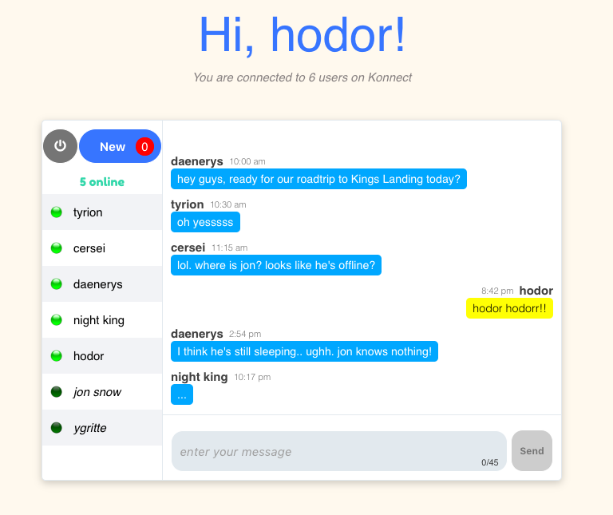

# Konnect
###### Konnect is a real-time chat app. If you're passionate about something, why do it alone? Let's Konnect!

# Tech Stack
- [Node.js](https://nodejs.org/en/)
- [Express](http://expressjs.com/)
- [Socket.io](http://socket.io/)
- [MongoDB](https://www.mongodb.com/)
- [React](https://facebook.github.io/react/)
- [Redux](https://redux.js.org/)
- [Webpack](https://webpack.js.org/)

# Set up
###### Set up process assumes that all of the above technologies are available on your machine
1. `git clone https://github.com/terrancexin/konnect.git`
2. `cd` into `konnect` folder and run `npm install`
3. please make sure `mongod` database is running
4. please make sure `webpack -w` is running
5. `npm run dev`
6. open a new browser and go to `http://localhost:3000/`
setup extras: enable fake seeds by going into `index.js` on line:31 & 32, uncomment and restart the server

## High Level Overview
Build real-time chat functionality
- A single-room chatroom
- Persist user info and messages
- Responsive design UI/UX
- Scalable and flexible system

## Features
- Join & leave a chatroom
- Link detection in message
- Loading spinner
- Mobile accessibility
- Online active/inactive status indicator
- Read unread messages since the last logout
- Real-time display of how many users are typing
- Secure authentication and session by using BCrypt to salt passwords
- Send & receive messages in real-time across different users
- User join & leave notification in real time

## Demo

## User Stories
- As a user, I want to authenticate my username and password.
- As a user, I want to join and leave the chatroom.
- As a user, I want to send and receive messages.
- As a user, I want to see my unread messages since last logout.
- As a user, I want to see all the messages in the chat room in real-time.
- As a user, I want to see whoever is typing in real time.
- As a user, I want to see whoever joins/leaves in real time.
- As a user, I want to see the number of users registered on Konnect.
- As a user, I want to see the number of users currently online.

## Tech Debts
- Implement redis cache for inefficient queries and reduce db queries
- Add tests
- Add more responsiveness on the UI
- Set up load balancer for scaling